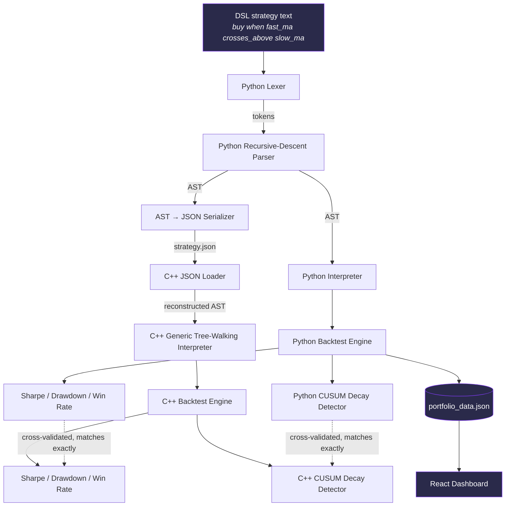
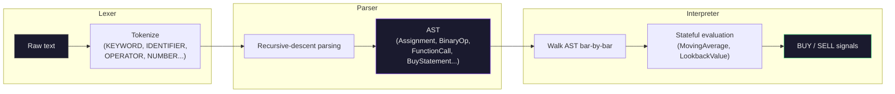
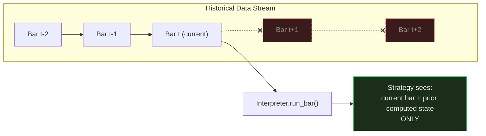

# VIGIL

**A strategy backtesting engine with statistical decay detection.**

VIGIL is a system for defining trading strategies in a custom-built language, testing them against real historical market data under strict correctness guarantees, and continuously monitoring them for statistical decay — the point at which a strategy's underlying edge quietly stops working, often long before cumulative losses make it obvious.

It was built as an end-to-end engineering project spanning three distinct disciplines: **language design** (a hand-written lexer, parser, and interpreter), **systems programming** (a dual-language, cross-validated execution engine in Python and C++), and **applied statistics** (a from-scratch change-point detection system).

---

## Table of Contents

- [Why This Project Exists](#why-this-project-exists)
- [What VIGIL Does](#what-vigil-does)
- [Architecture](#architecture)
- [Key Engineering Decisions](#key-engineering-decisions)
- [Results](#results)
- [Tech Stack](#tech-stack)
- [Project Structure](#project-structure)
- [Setup — Running VIGIL Locally](#setup--running-vigil-locally)
- [Limitations](#limitations)
- [Future Work](#future-work)

---

## Why This Project Exists

Trading strategies decay. A pattern that produces real returns in one market regime can quietly stop working as conditions shift — not because the code breaks, but because the statistical relationship it depends on erodes. This is a well-known, expensive problem in quantitative finance, usually called **alpha decay**.

The common failure mode: a strategy keeps trading and keeps sometimes winning, so nothing looks obviously wrong. By the time cumulative profit-and-loss clearly shows the damage, meaningful losses have often already occurred — and with many strategies running at once, nobody is watching each one closely enough to catch it early.

VIGIL doesn't attempt to predict markets — no system reliably can. Instead, it addresses a narrower, achievable problem: given a strategy and its trading history, **detect when its statistical behavior has shifted from its established baseline**, using the same trades that are already happening, before the P&L trend makes it obvious.

---

## What VIGIL Does

**1. A custom strategy DSL.** Strategies are written declaratively:

```
fast_ma = moving_average(close, 5)
slow_ma = moving_average(close, 20)
buy when fast_ma crosses_above slow_ma
sell when fast_ma crosses_below slow_ma
```

This text is tokenized by a hand-written lexer, built into an Abstract Syntax Tree (AST) by a recursive-descent parser, and executed by a tree-walking interpreter with real state — for example, a moving average that remembers prior prices, or a crossover check that remembers the previous bar's values.

**2. Two independent, cross-validated execution engines.** A Python reference implementation is built first for fast iteration. Its parser can serialize any parsed strategy's AST into JSON — a plain, language-agnostic format. A C++ engine loads that JSON, reconstructs an equivalent AST, and executes it generically, with no strategy-specific code. Both engines are validated against each other **trade-by-trade** across a 20-stock, 5-year portfolio (700+ trades), matching exactly on trade dates, P&L, Sharpe ratio, and max drawdown.

**3. Realistic backtesting.** Every simulated trade accounts for slippage and commission costs. Risk is measured with standard metrics: Sharpe ratio, maximum drawdown, and win rate — computed independently in both engines.

**4. Strict zero-look-ahead enforcement.** Both engines process market data as a strict, ordered stream — one bar at a time. A strategy's logic is only ever given the current bar and whatever it has already computed from earlier bars; there is no code path through which future data could reach a trading decision. This isn't a convention that could be violated by mistake — it's a structural property of how the event loop is written.

**5. A decay detector.** CUSUM (Cumulative Sum) change-point detection — implemented from scratch, not via a statistics library — monitors each strategy's win rate for sustained, statistically meaningful deviation from an established baseline, in both the Python and C++ engines.

**6. A portfolio dashboard.** A React frontend presents live results across 20 real stocks and two structurally different strategies: equity curves, risk metrics, and a health score derived directly from decay detector output — including honest "insufficient data" states rather than false confidence when a strategy hasn't traded enough to judge.

---

## Architecture

### End-to-end data flow



### DSL pipeline (lexer → parser → interpreter)



### Zero-look-ahead enforcement (conceptual)



---

## Key Engineering Decisions

**Why a custom DSL instead of writing strategies directly in Python?**
A DSL forces every strategy to be expressed as *data* — an AST — rather than arbitrary imperative code. That constraint is what makes the Python-to-C++ bridge possible: a parsed strategy can be serialized to JSON and handed to a completely different language for execution. Arbitrary Python code has no equivalent portable representation.

**Why build the engine twice, in two different languages, instead of trusting one implementation?**
Backtesting bugs are easy to introduce and expensive to miss — particularly look-ahead bias, where a strategy accidentally gains access to future data and appears profitable in testing while being unusable live. Requiring two independent implementations to agree exactly, trade-by-trade, is a genuine correctness check rather than an assumption.

**Why CUSUM instead of monitoring cumulative P&L directly?**
Cumulative P&L is noisy and lags behind the underlying problem. A strategy's win rate can degrade steadily across many trades while a few earlier large wins keep the total P&L looking healthy. CUSUM tracks sustained deviation from a baseline win rate directly, which surfaces the shift earlier and more reliably than watching the equity curve alone.

**Why report "insufficient data" instead of always producing a health score?**
A health score computed from very few trades is not meaningfully different from noise. The system enforces a minimum trade count before reporting a confident score, and says so explicitly otherwise — matching the same principle used by the CUSUM detector's own baseline-window requirement.

---

## Results

Tested across 20 NSE-listed (Nifty 50) stocks, 2020–2025, two structurally different strategies:

| Strategy | Behavior observed |
|---|---|
| 5/20 moving-average crossover (momentum) | Inconsistent across stocks — win rates ranged from ~31% to ~59%. 13 of 20 stocks showed a detected win-rate shift (decay) over the test window. |
| 6-month mean-reversion | High win rates on stocks where it triggered, but most stocks produced too few trades (1–8) for the result to be statistically meaningful — reported honestly as insufficient data rather than a false score. |

These results are reported as-is, without cherry-picking. The goal of VIGIL was never to discover a strategy that reliably makes money — it was to build a system capable of evaluating *any* strategy honestly, including ones that perform inconsistently or fail outright. A backtester that only ever shows favorable results is a stronger signal of a bug (most often look-ahead bias) than of a good strategy.

---

## Tech Stack

| Layer | Technology |
|---|---|
| DSL & reference engine | Python 3, pandas, numpy |
| Production engine | C++17, [nlohmann/json](https://github.com/nlohmann/json) |
| Dashboard | React (Vite), Recharts |
| Market data | Yahoo Finance via `yfinance`, daily OHLCV bars |
| Change-point detection | Hand-implemented CUSUM (no external stats library) |

---

## Project Structure

```
VIGIL/
├── dsl_lexer.py            # Tokenizer
├── dsl_parser.py           # Recursive-descent parser → AST
├── dsl_interpreter.py      # Reference interpreter + backtest engine (Python)
├── decay_detector.py       # CUSUM change-point detector (Python)
├── dsl_to_json.py          # Serializes a parsed AST to JSON for the C++ engine
├── run_portfolio.py        # Runs all strategies across the full stock portfolio
├── fetch_data.py           # Pulls historical OHLCV data
├── data/                   # Historical price CSVs (20 stocks, 2020–2025)
│
├── cpp_engine/              # C++ production engine
│   ├── ast_nodes.h          # AST node type definitions
│   ├── json_to_ast.h        # JSON → C++ AST loader
│   ├── interpreter.h        # Generic tree-walking interpreter
│   ├── decay_detector.h     # CUSUM detector (C++)
│   ├── moving_average.h     # Stateful moving average
│   ├── lookback_value.h     # Stateful N-bars-ago lookup
│   ├── data_loader.h        # CSV price data loader
│   └── main.cpp             # Portfolio backtest runner
│
└── dashboard/                # React dashboard
    └── src/App.jsx
```

---

## Setup — Running VIGIL Locally

### Prerequisites

- Python 3.10+
- A C++17-capable compiler (e.g. `g++` via [MSYS2](https://www.msys2.org/) on Windows, or `clang++`/`g++` on macOS/Linux)
- Node.js 18+ and npm

### 1. Clone the repository

```bash
git clone https://github.com/Arjunpaan/VIGIL.git
cd VIGIL
```

### 2. Python environment

```bash
python -m venv venv
source venv/bin/activate        # Windows: venv\Scripts\Activate.ps1
pip install pandas numpy yfinance
```

### 3. Fetch historical data

```bash
python fetch_data.py
```

Downloads daily OHLCV data for 20 Nifty 50 stocks (2020–2025) into `data/`.

### 4. Run the Python backtest across the full portfolio

```bash
python run_portfolio.py
```

Runs both strategies against every stock, computes Sharpe ratio, max drawdown, and CUSUM decay flags, and writes `portfolio_data.json`.

### 5. Build and run the C++ engine

```bash
cd cpp_engine
g++ main.cpp -o vigil -std=c++17
./vigil
```

Independently re-runs the same portfolio backtest in C++ and writes `cpp_portfolio_results.json` — compare against the Python output to verify cross-validation.

> **Windows note:** if using MSYS2's `g++`, ensure `C:\msys64\ucrt64\bin` (or your MSYS2 install path) is on your `PATH` so the compiler's runtime DLLs resolve correctly.

### 6. Run the dashboard

```bash
cd dashboard
npm install
cp ../portfolio_data.json public/portfolio_data.json
npm run dev
```

Open the printed local URL (typically `http://localhost:5173`) in a browser.

---

## Limitations

Stated plainly, not glossed over:

- **Daily bars only.** The engine operates on daily OHLCV data, not intraday or tick-level data. This was a deliberate scope decision — daily data is sufficient to demonstrate the architecture without the substantially higher data-volume and performance demands of tick-level processing.
- **The decay detector catches *shifts*, not *consistent underperformance*.** A strategy that was poorly suited to a stock from the very first trade won't be flagged as "decaying," because nothing changed — it simply never worked. This is a deliberate scope boundary of change-point detection, not an oversight.
- **The DSL's grammar is intentionally minimal.** It currently supports the operations needed by the two strategies built for this project (assignment, function calls, comparisons, `crosses_above`/`crosses_below`). Compound conditions (`and`/`or`) and additional comparison operators (`>=`, `!=`) are not yet implemented.
- **Strategy results should not be interpreted as investment advice.** The strategies used to exercise this system are standard, textbook examples (moving-average crossover, mean-reversion), chosen to test the engine's correctness — not the result of original strategy research.

---

## Future Work

- Extend the DSL grammar with logical operators (`and`/`or`) and additional comparisons (`>=`, `!=`)
- Automated unit test suite for the lexer, parser, and both interpreters
- Full Nifty 50 coverage (currently 20 of 50 constituents)
- Live/streaming data ingestion, replacing the current batch-CSV replay model
- Position sizing and portfolio-level risk allocation, rather than fixed single-unit trades

---

## Author

Built end-to-end — DSL design, dual-language backtesting engine, statistical decay detection, and dashboard — as a demonstration of language design, systems programming, and applied statistics working together in one coherent system.
