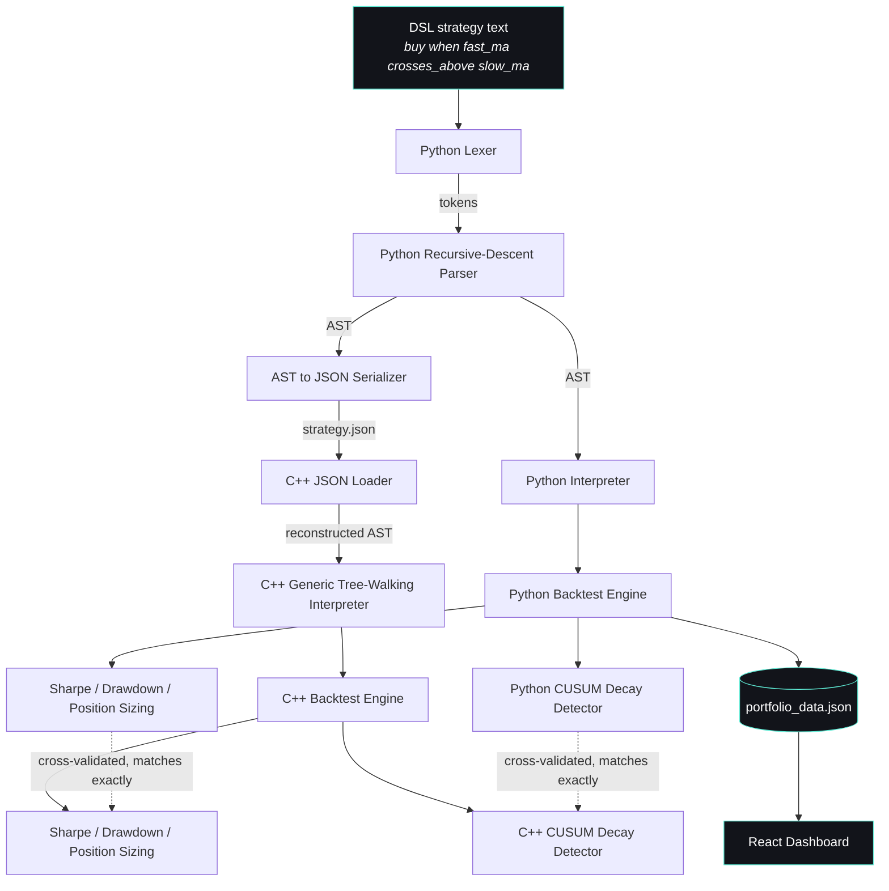
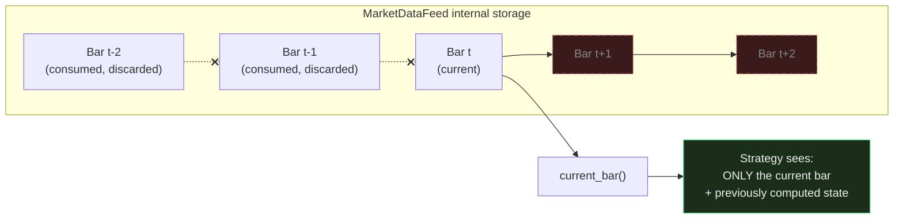

# VIGIL

**[Live Dashboard →](https://vigil-beta-two.vercel.app/)**

**A strategy backtesting engine with statistical decay detection.**

VIGIL is a system for defining trading strategies in a custom-built language, testing them against real historical market data under strict correctness guarantees, sizing positions with real risk controls, and continuously monitoring strategies — in both batch and simulated real-time modes — to detect when their underlying statistical edge is degrading, often before cumulative losses make it obvious.

It was built as an end-to-end engineering project spanning four disciplines: **language design** (a hand-written lexer, parser, and interpreter), **systems programming** (a dual-language, cross-validated execution engine in Python and C++), **applied statistics** (a from-scratch change-point detection system), and **full-stack engineering** (a live backend service polled by a React dashboard).

---

## Table of Contents

- [Why This Project Exists](#why-this-project-exists)
- [What VIGIL Does](#what-vigil-does)
- [Architecture](#architecture)
- [Key Engineering Decisions](#key-engineering-decisions)
- [Results](#results)
- [Tech Stack](#tech-stack)
- [Project Structure](#project-structure)
- [Setup — Running VIGIL Locally](#setup--running-vigil-locally)
- [Limitations](#limitations)
- [Future Work](#future-work)

---

## Why This Project Exists

Trading strategies decay. A pattern that produces real returns in one market regime can quietly stop working as conditions shift — not because the code breaks, but because the statistical relationship it depends on erodes. This is a well-known, expensive problem in quantitative finance, usually called **alpha decay**.

The common failure mode: a strategy keeps trading and keeps sometimes winning, so nothing looks obviously wrong. By the time cumulative profit-and-loss clearly shows the damage, meaningful losses have often already occurred — and with many strategies running at once, nobody is watching each one closely enough to catch it early.

VIGIL doesn't attempt to predict markets — no system reliably can. Instead, it addresses a narrower, achievable problem: given a strategy and its trading history, **detect when its statistical behavior has shifted from its established baseline**, using the trades that are already happening, before the P&L trend makes it obvious — and do so both retrospectively (batch backtesting) and continuously (simulated live monitoring).

---

## What VIGIL Does

**1. A custom strategy DSL.** Strategies are written declaratively:

```
fast_ma = moving_average(close, 5)
slow_ma = moving_average(close, 20)
buy when fast_ma crosses_above slow_ma
sell when fast_ma crosses_below slow_ma
```

The grammar supports variable assignment, function calls, comparisons (`<`, `>`, `<=`, `>=`, `!=`, `crosses_above`, `crosses_below`), and compound conditions via logical operators (`and`, `or`). Parsed by a hand-built lexer and recursive-descent parser into an AST, and executed by a tree-walking interpreter with real state — moving averages that remember price history, RSI calculations that track rolling gains/losses, lookback values that remember prices from N bars ago.

**2. Three strategy families**, chosen to be structurally distinct rather than variations on one idea:
- **Momentum crossover** — moving-average crossovers (`crosses_above` / `crosses_below`)
- **Mean reversion** — comparison against a historical lookback price
- **RSI oversold/overbought** — a stateful momentum oscillator tracking rolling average gains and losses

**3. Two independent, cross-validated execution engines.** A Python reference implementation is built first for fast iteration. Its parser serializes any parsed strategy's AST into JSON — a plain, language-agnostic format. A C++ engine loads that JSON, reconstructs an equivalent AST, and executes it generically, with no strategy-specific code. Both engines are validated against each other **trade-by-trade** across a 49-stock, 5-year portfolio (2,600+ trades across three strategy types), matching exactly on trade dates, P&L, Sharpe ratio, and max drawdown.

**4. Realistic backtesting with position sizing.** Every simulated trade accounts for slippage and commission costs. Beyond simple fixed-unit trading, VIGIL implements **fixed-fractional position sizing**: given account equity and a per-trade risk limit (e.g. never risk more than 2% of equity), the engine computes an explicit stop-loss and sizes each position so that a stop-loss exit costs exactly the intended, bounded amount — regardless of the stock's price or volatility. Risk is measured with Sharpe ratio, maximum drawdown, and win rate, computed independently in both engines.

**5. Strict zero-look-ahead enforcement, structurally guaranteed.** Both engines process market data through a dedicated feed object (`MarketDataFeed` / `market_feed.h`) that exposes only two operations: advance to the next bar, and read the current bar. Once a bar is consumed it is physically removed from the feed's internal storage — there is no method, index, or reference through which a strategy could reach future data. This is enforced by the absence of any such code path, not by convention.

**6. A decay detector.** CUSUM (Cumulative Sum) change-point detection — implemented from scratch, not via a statistics library — monitors a strategy's win rate for sustained, statistically meaningful deviation from an established baseline, in both the Python and C++ engines. It runs in two modes:
   - **Batch mode**: evaluated once across a strategy's full historical trade history
   - **Live mode**: re-evaluated after every new trade as data streams in, enabling real-time decay alerts rather than end-of-run reports

**7. A simulated live-streaming layer.** Rather than only replaying historical data as a single batch, VIGIL includes a `LiveFeedSimulator` (Python and C++) that wraps `MarketDataFeed` and replays bars with real wall-clock pacing — architecturally identical to how a genuine live data feed would be consumed, without requiring a paid market data subscription. A Flask backend runs this live loop in a background thread and exposes current state through a REST endpoint; the React dashboard polls it every two seconds, so trades and decay alerts appear on screen as they happen rather than after a batch job completes.

**8. A portfolio dashboard.** A React frontend presents results across 49 real stocks and three strategy types: equity curves, risk metrics, a health score derived directly from decay detector output — including honest "insufficient data" states — and a live panel showing a currently-streaming strategy's status in real time.

---

## Architecture

### End-to-end data flow (batch backtesting)



### Live-streaming architecture

```mermaid
flowchart LR
    A[Historical CSV] --> B["LiveFeedSimulator<br/>(wraps MarketDataFeed,<br/>adds real wall-clock delay)"]
    B -->|one bar at a time| C[Interpreter]
    C --> D[Trade Executed?]
    D -->|yes| E["CUSUM Decay Detector<br/>re-evaluated after every trade"]
    D --> F["Shared live_state<br/>(thread-safe, lock-protected)"]
    E --> F

    F -.->|background thread| G[Flask Background Thread]
    G --> H["/api/live-status<br/>REST endpoint"]
    H -->|polled every 2s| I[React LiveView Component]
    I --> J[Dashboard: live bars, trades,<br/>health score, status]

    style B fill:#12141a,stroke:#5eead4,color:#eee
    style H fill:#12141a,stroke:#fbbf24,color:#eee
    style J fill:#12141a,stroke:#5eead4,color:#eee
```



### Zero-look-ahead enforcement (conceptual)



---

## Key Engineering Decisions

**Why a custom DSL instead of writing strategies directly in Python?**
A DSL forces every strategy to be expressed as *data* — an AST — rather than arbitrary imperative code. That constraint is what makes the Python-to-C++ bridge possible: a parsed strategy can be serialized to JSON and handed to a completely different language for execution. Arbitrary Python code has no equivalent portable representation.

**Why build the engine twice, in two different languages, instead of trusting one implementation?**
Backtesting bugs are easy to introduce and expensive to miss — particularly look-ahead bias, where a strategy accidentally gains access to future data and appears profitable in testing while being unusable live. Requiring two independent implementations to agree exactly, trade-by-trade, is a genuine correctness check rather than an assumption. This discipline was applied to every feature added, including position sizing and RSI — each was implemented in Python first, then ported to C++ and validated against Python's output before being considered complete.

**Why CUSUM instead of monitoring cumulative P&L directly?**
Cumulative P&L is noisy and lags behind the underlying problem. A strategy's win rate can degrade steadily across many trades while a few earlier large wins keep the total P&L looking healthy. CUSUM tracks sustained deviation from a baseline win rate directly, which surfaces the shift earlier and more reliably than watching the equity curve alone.

**Why fixed-fractional position sizing instead of fixed-unit trades?**
Trading a fixed number of units regardless of price or risk is not how real risk management works. Fixed-fractional sizing — risking a constant percentage of equity per trade, sized against an explicit stop-loss distance — means every trade's worst-case loss is known and bounded in advance, which is a materially more honest simulation of how a real account would be managed.

**Why report "insufficient data" instead of always producing a health score?**
A health score computed from very few trades is not meaningfully different from noise. The system enforces a minimum trade count before reporting a confident score, and says so explicitly otherwise — matching the same principle used by the CUSUM detector's own baseline-window requirement.

**Why a simulated live feed instead of a real market data subscription?**
A genuine live feed requires a paid data subscription and infrastructure outside the scope of a portfolio project. `LiveFeedSimulator` replays historical data with real wall-clock pacing through the exact same `MarketDataFeed` interface used in batch mode — the ingestion architecture (continuous, one-bar-at-a-time, background-threaded, API-exposed) is the real thing being demonstrated; only the ultimate data source differs from a production system.

---

## Results

Tested across 49 NSE-listed (Nifty 50) stocks, 2020–2025, across three strategy types:

| Strategy | Behavior observed |
|---|---|
| 5/20 moving-average crossover (momentum) | Inconsistent across stocks — win rates ranged from ~31% to ~63%. 35 of 49 stocks showed a detected win-rate shift (decay) over the test window. |
| 6-month mean-reversion | High win rates on stocks where it triggered, but most stocks produced too few trades (1–8) for the result to be statistically meaningful — reported honestly as insufficient data rather than a false score. |
| RSI oversold/overbought | Notably weak during the March 2020 COVID crash specifically — the strategy repeatedly bought "oversold" dips during a sustained crash rather than a temporary one, triggering a cluster of stop-loss exits. A well-documented failure mode of naive mean-reversion logic, correctly contained (not prevented) by the position-sizing stop-loss system. |

With position sizing applied (₹100,000 starting equity, 2% risk per trade, 5% stop-loss), results varied substantially by stock and strategy — for example, SHRIRAMFIN returned +91.3% under the RSI strategy versus +5.2% under mean-reversion on the same stock and period, illustrating that strategy selection genuinely matters per-instrument rather than one strategy dominating uniformly.

These results are reported as-is, without cherry-picking. The goal of VIGIL was never to discover a strategy that reliably makes money — it was to build a system capable of evaluating *any* strategy honestly, including ones that perform inconsistently or fail outright. A backtester that only ever shows favorable results is a stronger signal of a bug (most often look-ahead bias) than of a good strategy.

---

## Tech Stack

| Layer | Technology |
|---|---|
| DSL & reference engine | Python 3, pandas, numpy |
| Production engine | C++17, [nlohmann/json](https://github.com/nlohmann/json) |
| Live backend | Flask, Flask-CORS, background threading |
| Dashboard | React (Vite), Recharts |
| Market data | Yahoo Finance via `yfinance`, daily OHLCV bars |
| Change-point detection | Hand-implemented CUSUM (no external stats library) |
| Deployment | Vercel (static dashboard) |

---

## Project Structure

```
VIGIL/
├── dsl_lexer.py               # Tokenizer
├── dsl_parser.py               # Recursive-descent parser to AST
├── dsl_interpreter.py          # Reference interpreter + backtest engine (Python)
├── decay_detector.py           # CUSUM change-point detector (Python)
├── market_feed.py               # Structural zero-look-ahead data feed (Python)
├── live_feed_simulator.py       # Wall-clock-paced replay wrapper (Python)
├── live_server.py               # Flask backend: background live loop + REST API
├── live_monitor.py              # Standalone live-monitoring CLI demo (Python)
├── dsl_to_json.py               # Serializes a parsed AST to JSON for the C++ engine
├── run_portfolio.py             # Runs all strategies across the full stock portfolio
├── fetch_data.py                # Pulls historical OHLCV data
├── data/                        # Historical price CSVs (49 stocks, 2020-2025)
│
├── cpp_engine/                   # C++ production engine
│   ├── ast_nodes.h                # AST node type definitions (incl. LogicalOp)
│   ├── json_to_ast.h              # JSON to C++ AST loader
│   ├── interpreter.h              # Generic tree-walking interpreter
│   ├── decay_detector.h           # CUSUM detector (C++)
│   ├── moving_average.h           # Stateful moving average
│   ├── lookback_value.h           # Stateful N-bars-ago lookup
│   ├── rsi.h                      # Stateful RSI indicator
│   ├── market_feed.h              # Structural zero-look-ahead data feed (C++)
│   ├── live_feed_simulator.h      # Wall-clock-paced replay wrapper (C++)
│   ├── live_monitor.cpp           # Standalone live-monitoring executable
│   ├── data_loader.h              # CSV price data loader
│   └── main.cpp                   # Portfolio backtest + position sizing runner
│
└── dashboard/                     # React dashboard
    └── src/
        ├── App.jsx                 # Main portfolio view
        └── LiveView.jsx            # Live-streaming panel (polls Flask backend)
```

---

## Setup — Running VIGIL Locally

### Prerequisites

- Python 3.10+
- A C++17-capable compiler (e.g. `g++` via [MSYS2](https://www.msys2.org/) on Windows, or `clang++`/`g++` on macOS/Linux)
- Node.js 18+ and npm

### 1. Clone the repository

```bash
git clone https://github.com/Arjunpaan/VIGIL.git
cd VIGIL
```

### 2. Python environment

```bash
python -m venv venv
source venv/bin/activate        # Windows: venv\Scripts\Activate.ps1
pip install pandas numpy yfinance flask flask-cors pytest
```

### 3. Fetch historical data

```bash
python fetch_data.py
```

Downloads daily OHLCV data for 49 Nifty 50 stocks (2020–2025) into `data/`.

### 4. Run the Python backtest across the full portfolio

```bash
python run_portfolio.py
```

Runs all three strategies against every stock (both fixed-unit and position-sized modes), computes Sharpe ratio, max drawdown, and CUSUM decay flags, and writes `portfolio_data.json` and `position_sized_results.json`.

### 5. Run the automated test suite

```bash
python -m pytest -v
```

Covers the lexer, parser, interpreter, and the `MarketDataFeed` zero-look-ahead guarantee.

### 6. Build and run the C++ engine

```bash
cd cpp_engine
g++ main.cpp -o vigil -std=c++17
./vigil
```

Independently re-runs the same portfolio backtest in C++, including position sizing, and writes `cpp_portfolio_results.json` / `cpp_position_sized_results.json` — compare against the Python output to verify cross-validation.

> **Windows note:** if using MSYS2's `g++`, ensure `C:\msys64\ucrt64\bin` (or your MSYS2 install path) is on your `PATH` so the compiler's runtime DLLs resolve correctly.

### 7. Run the live-streaming demo (optional)

**Python CLI demo:**
```bash
python live_monitor.py
```

**C++ CLI demo:**
```bash
cd cpp_engine
g++ live_monitor.cpp -o live_monitor -std=c++17
./live_monitor
```

**Full live backend + dashboard integration:**
```bash
python live_server.py
```
Leave running, then start the dashboard (step 8) — the "Live Feed" panel connects automatically to `localhost:5000`.

### 8. Run the dashboard

```bash
cd dashboard
npm install
cp ../portfolio_data.json public/portfolio_data.json
npm run dev
```

Open the printed local URL (typically `http://localhost:5173`). The portfolio view works standalone; the live panel requires `live_server.py` to be running separately (step 7).

---

## Limitations

Stated plainly, not glossed over:

- **Daily bars only.** The engine operates on daily OHLCV data, not intraday or tick-level data — a deliberate scope decision, since daily data is sufficient to demonstrate the architecture without the substantially higher data-volume and performance demands of tick-level processing.
- **The live feed is simulated, not a real market data subscription.** `LiveFeedSimulator` replays historical CSVs with real wall-clock pacing; it does not connect to an actual exchange or data vendor. The ingestion and monitoring *architecture* is real and would generalize to a genuine feed with a different data source; the data itself is historical replay.
- **The live dashboard panel only works when running locally.** The deployed dashboard on Vercel is a static build with no persistent backend; `live_server.py` must be run on the visitor's own machine for the live panel to connect. This is a hosting-tier limitation (static hosting vs. a persistent server), not a code limitation.
- **Live monitoring currently tracks one stock/strategy at a time**, not the full 49-stock portfolio simultaneously. Extending to concurrent multi-stock live monitoring is a real, larger undertaking (managing N background threads and a parameterized API) rather than a small addition, and is listed under Future Work.
- **The decay detector catches *shifts*, not *consistent underperformance*.** A strategy that was poorly suited to a stock from the very first trade won't be flagged as "decaying," because nothing changed — it simply never worked. This is a deliberate scope boundary of change-point detection, not an oversight.
- **The DSL's grammar covers what the current strategies need.** Assignment, function calls, comparisons (including `>=`, `!=`), `crosses_above`/`crosses_below`, and logical `and`/`or` are supported; further operators would be added as new strategies require them.
- **Strategy results should not be interpreted as investment advice.** The strategies used to exercise this system are standard, well-known techniques (moving-average crossover, mean-reversion, RSI), chosen to test the engine's correctness across structurally different logic — not the result of original strategy research.

---

## Future Work

- Concurrent multi-stock, multi-strategy live monitoring (parameterized API, one background thread per tracked instrument)
- A persistently-hosted backend (e.g. Render/Railway) so the live dashboard panel works for visitors without running anything locally
- Additional DSL grammar as new strategy types require it
- Automated cross-validation tests (currently done manually per feature) comparing Python and C++ output programmatically
- Portfolio-level risk allocation across multiple simultaneous positions, rather than per-trade sizing in isolation

---

## Author

Built end-to-end — DSL design, dual-language backtesting engine, statistical decay detection, position sizing and risk management, simulated live-streaming architecture, and a full-stack dashboard — as a demonstration of language design, systems programming, applied statistics, and full-stack engineering working together in one coherent system.
